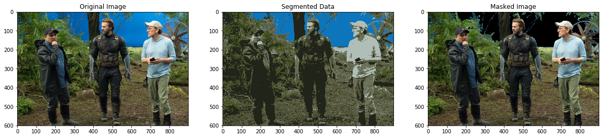

# KNN Experimenting 
 I created a **_KNN_** image clustering script to experiment with the algorithm.
 In this experiment I'm using _KNN to keyout a blue screen background_. 
 
 I used a **_K-cluster amount of 7_** to obtain the entire bluescreen. 
## Results

## Packages used:
* cv2
* numpy
* matplotlib
